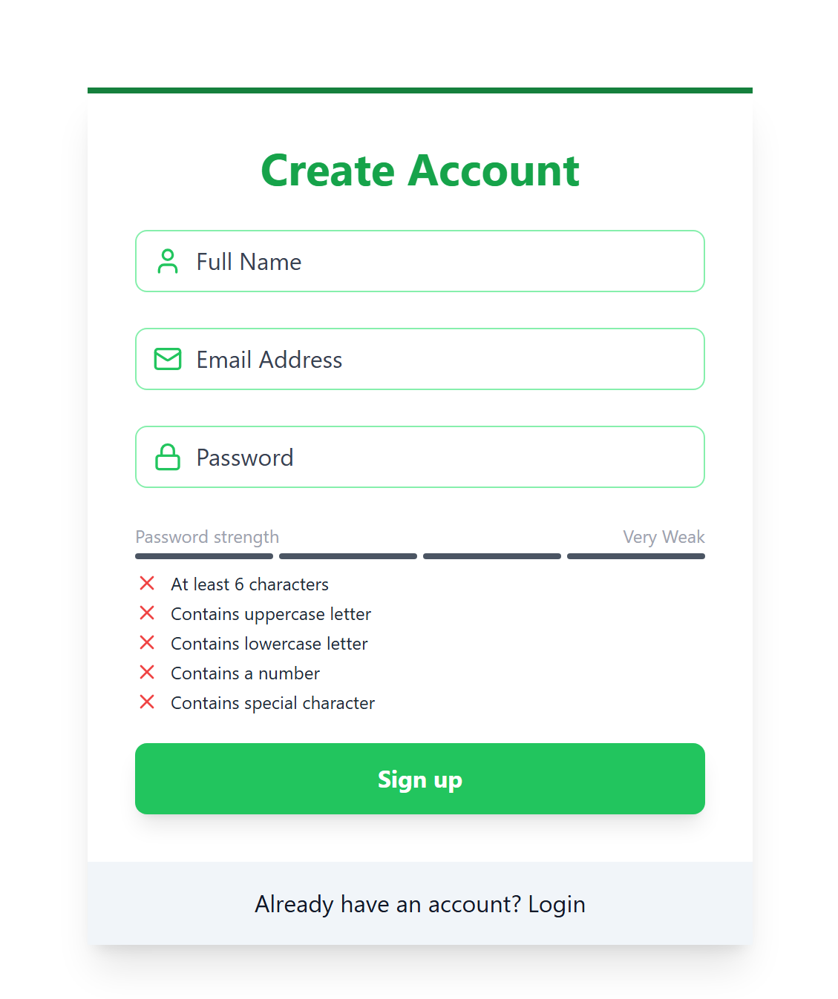
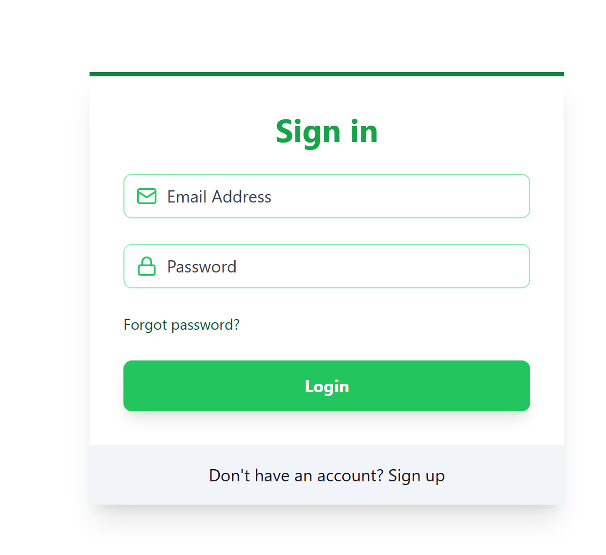
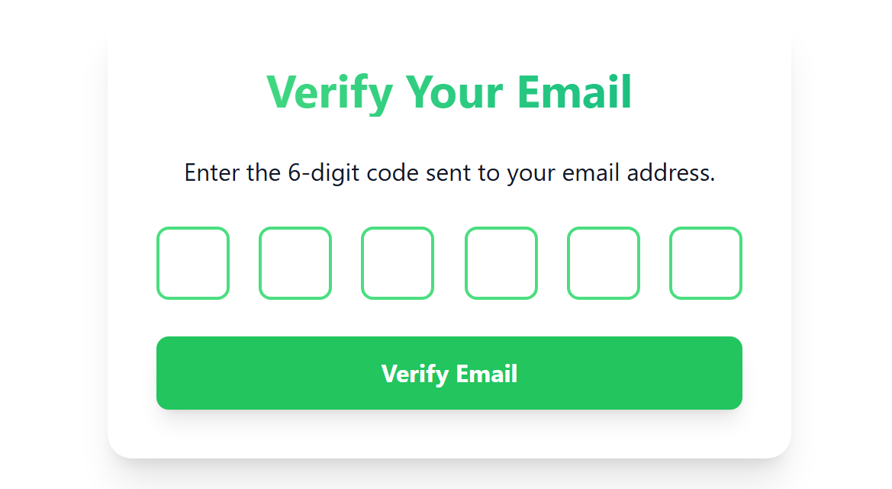
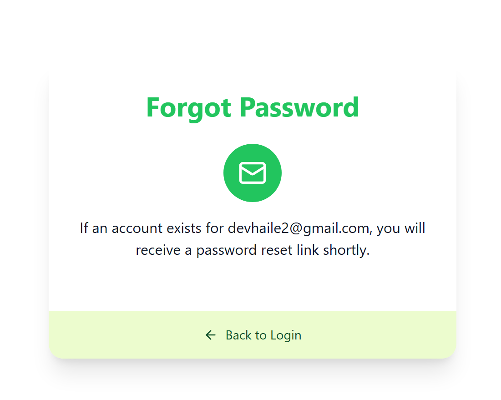
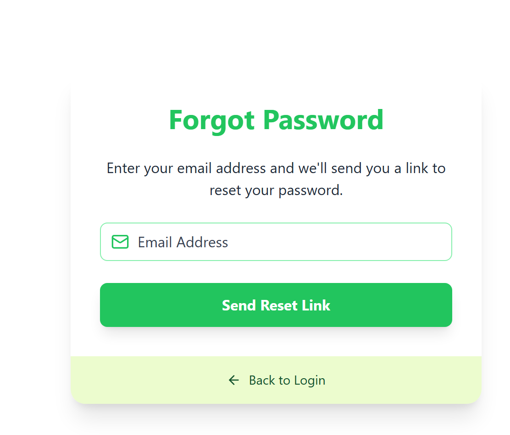
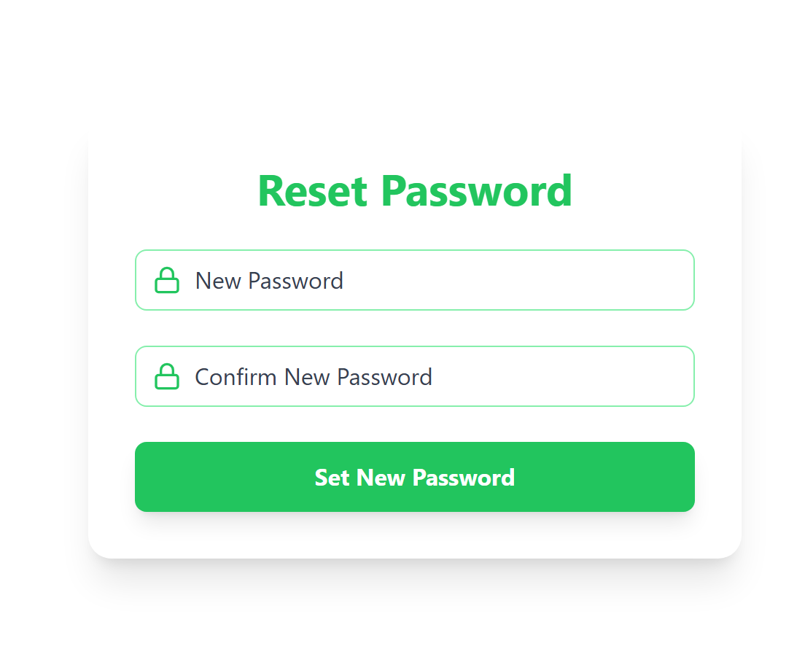

# Authentication

The project allows users to sign in, sign up, reset their passwords, receive verification emails, and log out. It provides secure user management and ensures that only verified users can access certain features.

## Showcase Images Side by Side

<div style="display: flex; justify-content: space-around;">
  
  
</div>

<div style="display: flex; justify-content: space-around;">
  
  
</div>

<div style="display: flex; justify-content: space-around;">
  
  
</div>

<!-- #### signup


#### login


#### verify-email


#### forgot-password


#### forgot-password


#### reset-password

 -->

## Features

- User Authentication System
- Email Verification Workflow
- Password Reset Mechanism
- Protected Routes Implementation
- Fully Functional Frontend UI
- Scalable and Secure Backend
- Deployment-Ready Project

## Setup

### Create a `.env` File

Add the following environment variables to your `.env` file:

```bash
MONGO_URI=your_mongo_uri
PORT=5000
JWT_SECRET=your_secret_key
NODE_ENV=development

MAILTRAP_TOKEN=your_mailtrap_token
MAILTRAP_ENDPOINT=https://send.api.mailtrap.io/

CLIENT_URL=http://localhost:5173
```

### Run This App Locally

1. **Install Dependencies:**

   ```bash
   npm install
   ```

2. **Build the App:**

   ```bash
   npm run build
   ```

3. **Start the App:**
   ```bash
   npm run start
   ```

---

## Screenshot


---
